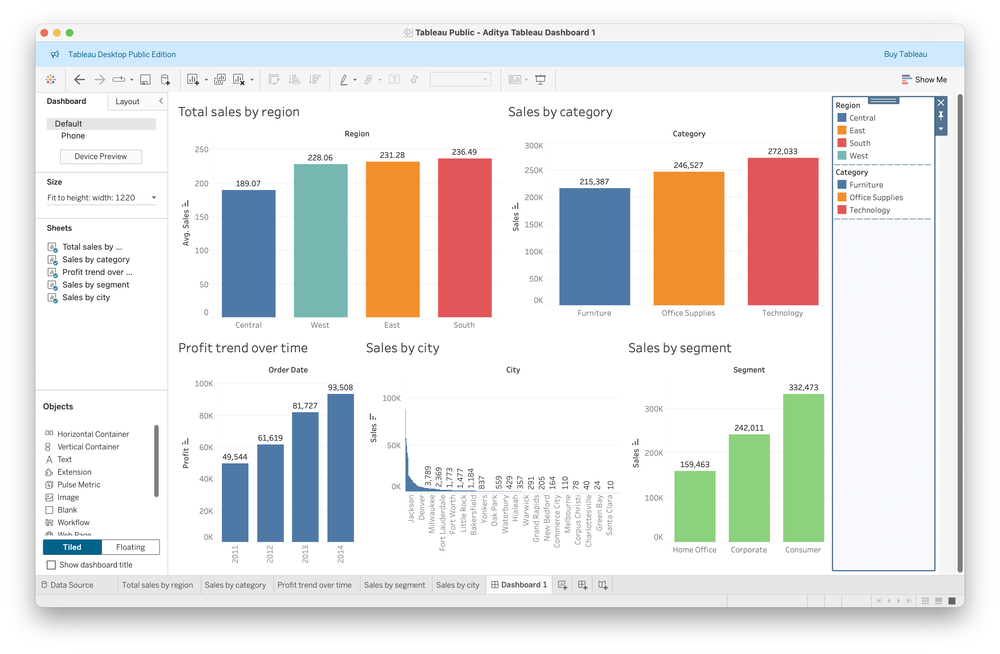
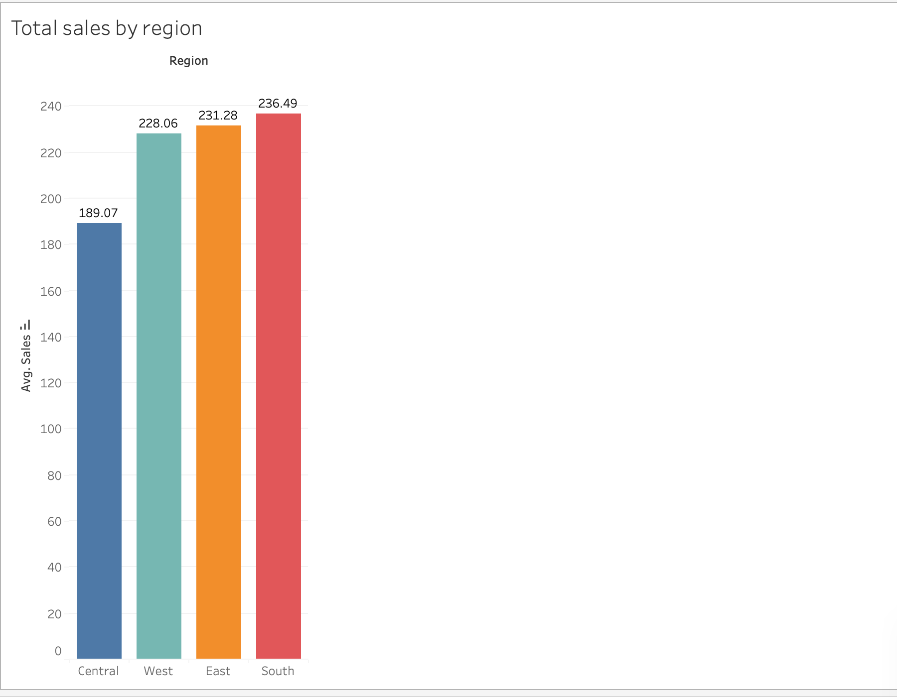
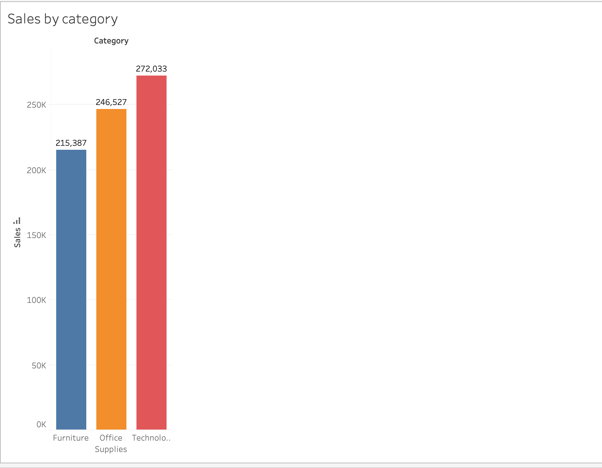
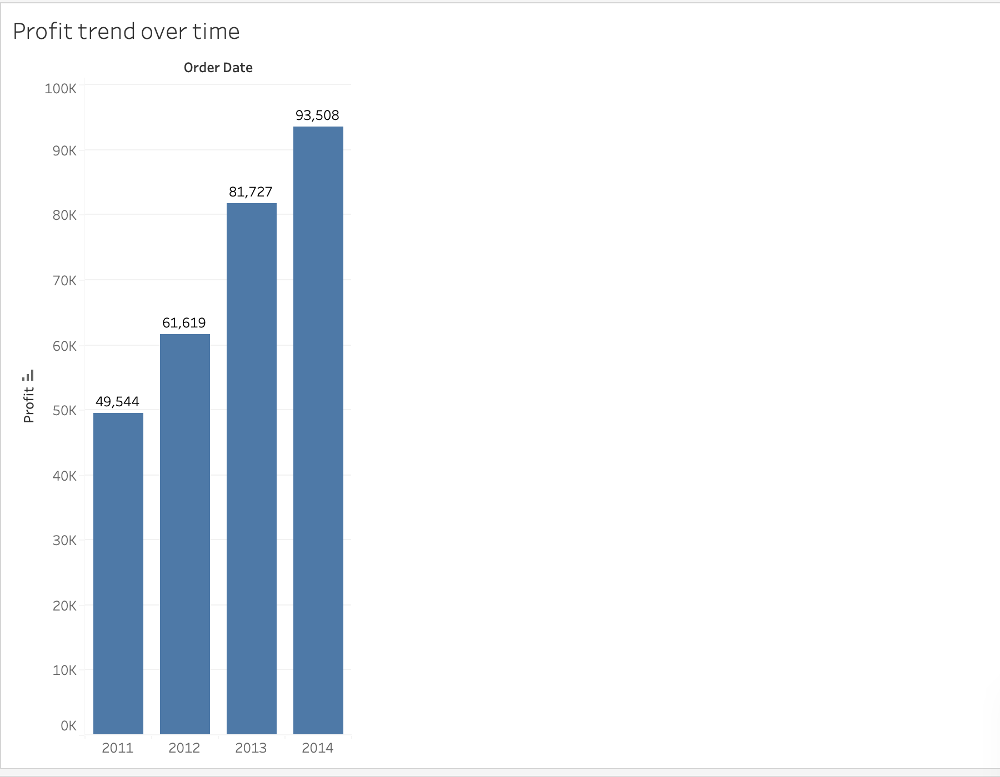
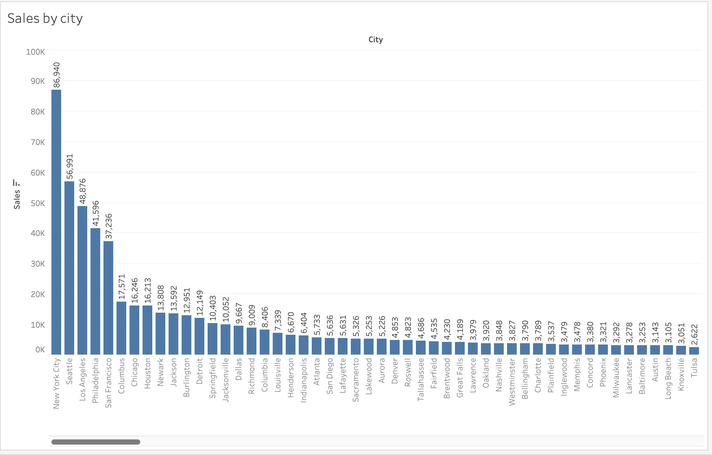
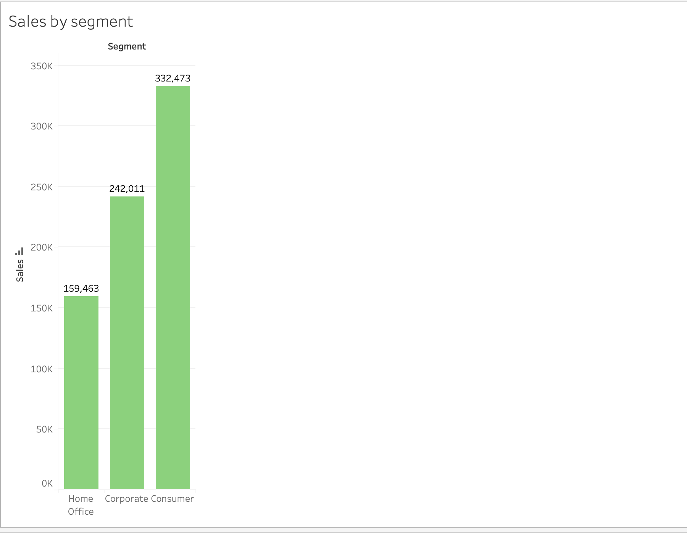

# 📊 Superstore Sales Analysis Dashboard (Tableau)

> An interactive **Tableau Dashboard** built using the Superstore dataset to analyze sales performance, profit trends, customer segments, product categories, and regional performance through powerful data visualization.



---

# 📌 Project Overview

This project demonstrates practical **Business Analytics**, **Business Intelligence**, and **Data Visualization** skills using **Tableau Public**.

The dashboard transforms raw sales data into meaningful business insights through interactive charts and visual reports. It enables users to monitor business performance, identify high-performing regions, evaluate product categories, analyze customer segments, and understand yearly profit trends.

---

# 🎯 Objectives

- 📊 Analyze sales performance across different regions
- 📦 Compare product category sales
- 📈 Track yearly profit growth
- 🏙 Identify top-performing cities
- 👥 Analyze customer segments
- 📉 Build an interactive business dashboard

---

# 🛠 Tools & Technologies

- Tableau Public
- Microsoft Excel
- Superstore Dataset

---

# 📸 Dashboard Preview

## 🌍 Total Sales by Region

Analyze average sales across different regions.



---

## 📦 Sales by Category

Compare sales generated by different product categories.



---

## 📈 Profit Trend Over Time

Visualize yearly business profit growth.



---

## 🏙 Sales by City

Identify cities generating the highest sales revenue.



---

## 👥 Sales by Segment

Compare sales contribution among different customer segments.



---

# 📊 Key Business Insights

- 📍 South Region recorded the highest average sales.
- 💻 Technology generated the highest overall sales.
- 👥 Consumer Segment contributed the largest share of revenue.
- 📈 Profit consistently increased from **2011–2014**.
- 🏙 New York City generated the highest sales among all cities.

---

# 📂 Repository Structure

```text
tableau-sales-performance-dashboard/
│
├── Dashboard/
│   └── Dashboard.twb
│
├── Dataset/
│   └── Superstore.xlsx
│
├── images/
│   ├── dashboard.png
│   ├── total-sales-by-region.png
│   ├── sales-by-category.png
│   ├── profit-trend-over-time.png
│   ├── sales-by-city.png
│   └── sales-by-segment.png
│
├── README.md
└── LICENSE
```

---

# 🚀 Skills Demonstrated

- Tableau Dashboard Development
- Business Analytics
- Data Visualization
- Business Intelligence
- Sales Analytics
- KPI Reporting
- Dashboard Design
- Data Storytelling
- Analytical Thinking

---

# 👨‍💻 Author

## Aditya Raj

🎓 **BBA – Business Analytics**

### 🔗 Connect with Me

**GitHub**

👉 https://github.com/AdityaRaj-BA

**LinkedIn**

👉 https://www.linkedin.com/in/aditya-raj-8b49b4249/

---

# ⭐ Support

If you found this project useful,

⭐ Star this repository

🍴 Fork this repository

💼 Connect with me on LinkedIn

---

<div align="center">

### ⭐ Thanks for visiting my project!

Made with ❤️ by **Aditya Raj**

</div>
